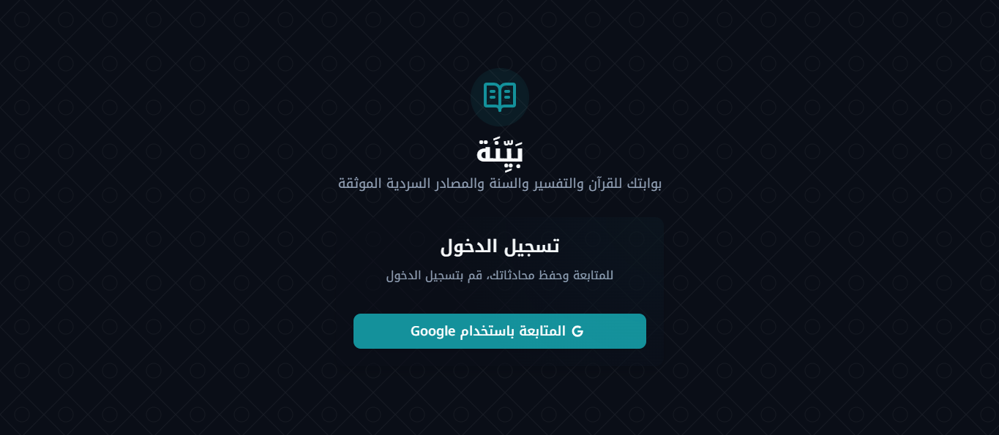
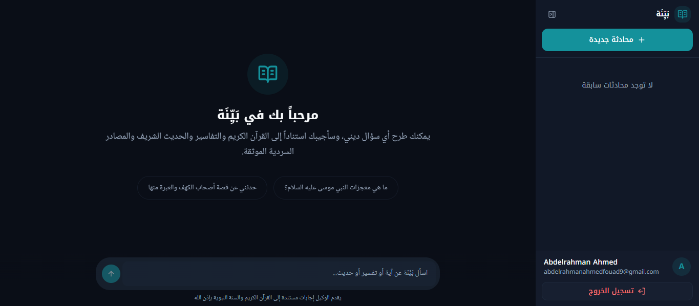
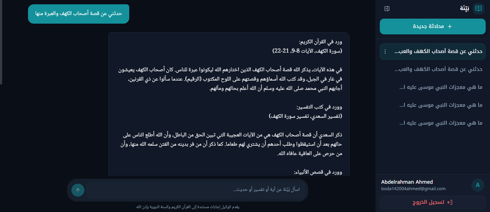
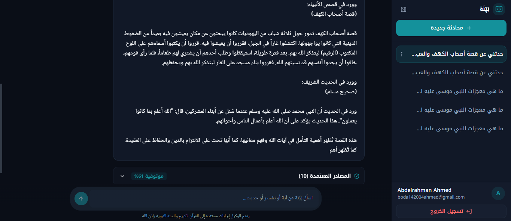
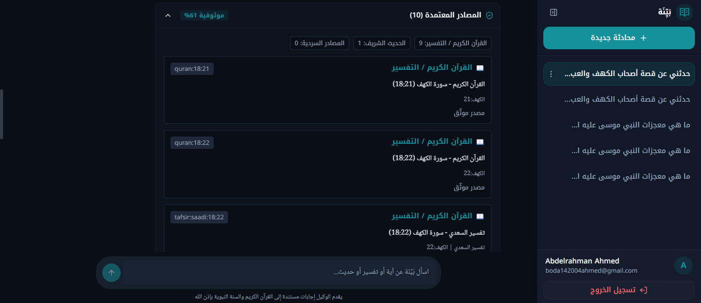
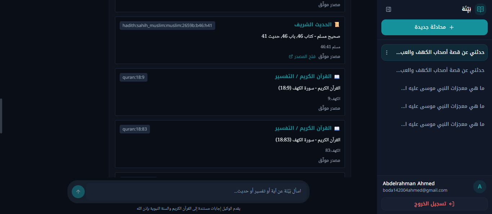
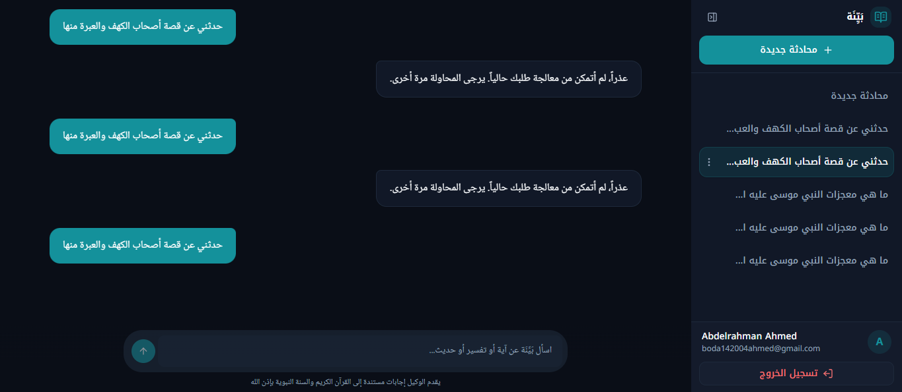
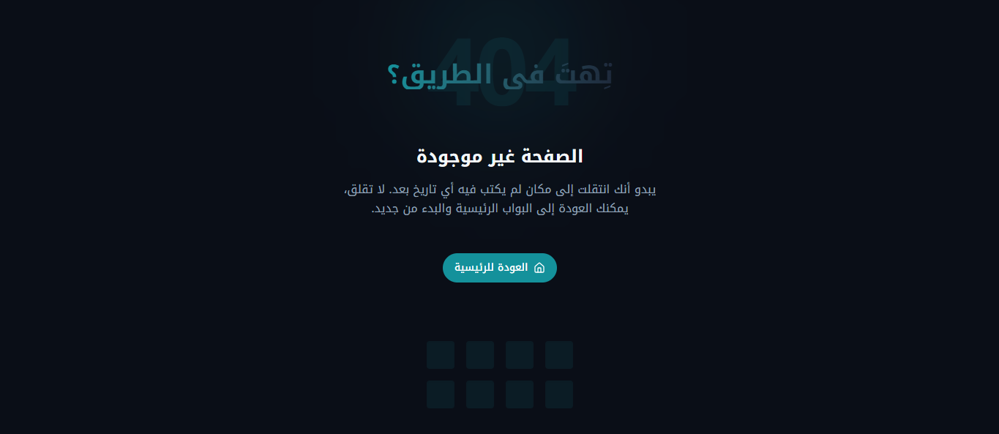

# بَيِّنَة — Frontend

Arabic-first web interface for **بَيِّنَة**, an Islamic AI assistant grounded in the **Qur’an**, **tafsir**, **Sunnah**, and curated **narrative resources**.

This repository contains the production frontend application built with **Next.js**, designed for a clean Arabic RTL chat experience with authentication, conversation history, and grounded answers with citations.

---

## Overview

بَيِّنَة is a retrieval-augmented Islamic assistant that helps users ask questions in Arabic and receive answers grounded in trusted sources.

The frontend is responsible for:
- user authentication
- conversation management
- streaming chat UI
- rendering citations and grounded answers
- responsive Arabic RTL user experience

---

## Live Website


- **Production:** `https://bayyinah-alpha.vercel.app/`

---

## Screenshots

### Login Screen


### Home / Chat Interface


### Chat Interface / Conversation History



### Citation / Source Display



### Error Handling


### Not-Found Screen


---

## Features

- Arabic-first **RTL** user interface
- Clean responsive chat experience for desktop and mobile
- Supabase authentication with Google sign-in
- Conversation history with rename / delete support
- Streaming assistant responses
- Citation-aware answer rendering
- SEO metadata, sitemap, robots, and app manifest
- Consistent Islamic-themed visual identity

---

## Tech Stack

- **Framework:** Next.js (App Router)
- **Language:** TypeScript
- **Styling:** Tailwind CSS
- **UI Components:** shadcn/ui
- **Icons:** lucide-react
- **Authentication:** Supabase Auth
- **Deployment:** Vercel

---

## Project Structure

```text
frontend/
├── src/
│   ├── app/              # App Router pages, metadata, globals
│   ├── components/       # Chat UI, sidebar, inputs, citations, shared UI
│   ├── contexts/         # Auth context
│   └── lib/              # API client, shared types
├── public/               # Static assets
├── .env.example
├── package.json
└── README.md
```

### Environment Variables

Create a local environment file:

```bash
cp .env.example .env.local
```

Create a local environment file:

```basd
NEXT_PUBLIC_SUPABASE_URL=your_supabase_url
NEXT_PUBLIC_SUPABASE_ANON_KEY=your_supabase_anon_key
NEXT_PUBLIC_API_BASE_URL=http://localhost:8000
NEXT_PUBLIC_SITE_URL=http://localhost:3000
```

### Local Development

Install dependencies:

```bash
npm install
```

Run the development server:

```bash
npm run dev
```

Open:
```bash
http://localhost:3000
```

### License

This project is licensed under the [MIT License](LICENSE) - see the [LICENSE](LICENSE) file for details.